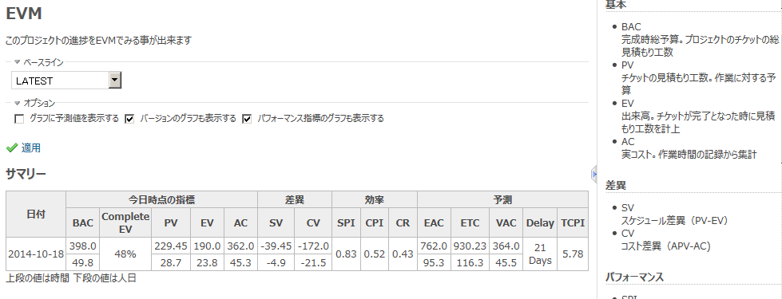
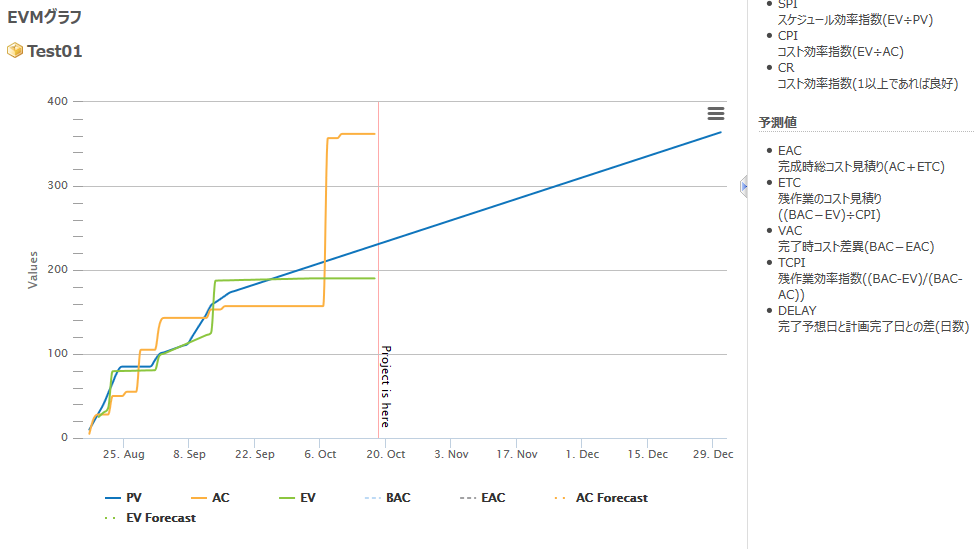

## redmine_evm_custom

オリジナルのredmine_evmをカスタマイズしています。
Original:https://github.com/imaginary-cloud/redmine_evm V1.0.0 (4-Jul-2014)

## About

このプラグインはチケットの予定工数、開始日、期日、進捗率、作業時間を使って、EVM値を計測しています。
ベースラインを設定することで計画変更前後での比較も行えます。

* PV:チケットの予定工数と開始日・期日で計算
* EV:完了したチケットの予定工数、完了前のチケットは進捗率で計算しています。完了日にEV値として予定工数を計上
* AC:作業実績。作業時間から計測。

本家からの主な変更点は以下の通り

1. 週単位でEVM値を算出していたのを日単位に変更(本家で対応したものを取り込む)
2. チケットが親子関係にあるとき子のチケットだけでEVM値を算出(本家で対応したものを取り込む)
3. グラフ表示をHighchartsへ変更
4. グラフ表示エリアを拡大
5. EVM値のBAC,EACをグラフ表示
6. 主要EVM値(PV,EV,AC,SV,CV,SPI,CPI,CR,BAC,EAC,VAC,TCPI)をサマリーとしてTOPに表示
7. EVM値の説明をサイドバーに表示 

## Installation

#### Use zip file

1. Download zip-file 
2. cd {redmine_root}/plugins/; mkdir redmine_evm 
3. Extract files to {redmine_root}/plugins/redmine_evm/
4. rake redmine:plugins:migrate NAME=redmine_evm RAILS_ENV=production

#### Use git clone

    git clone git://github.com/momibun926/redmine_evm_custom {redmine_root}/plugins/redmine_evm
    
## How to use

First make sure that the project planning is complete, then set up a baseline under the "Baselines" tab in the project settings.

## Screenshot

#### Main screen

#### New Baseline

#### Baseline list

#### Performance Cahrt

## Keywords

EVM, CPI, SPI, Earned Value Management, Baseline, Forecast, Redmine, Plugin

## Environment

Test on
* Redmine version                2.5.2.stable
* Ruby version                   1.9.3-p231 
* Rails version                  3.2.19
* Windows(Bitnami Installer)

## License

Copyright © 2014 ImaginaryCloud, imaginarycloud.com. This plugin is licensed under the MIT license.

